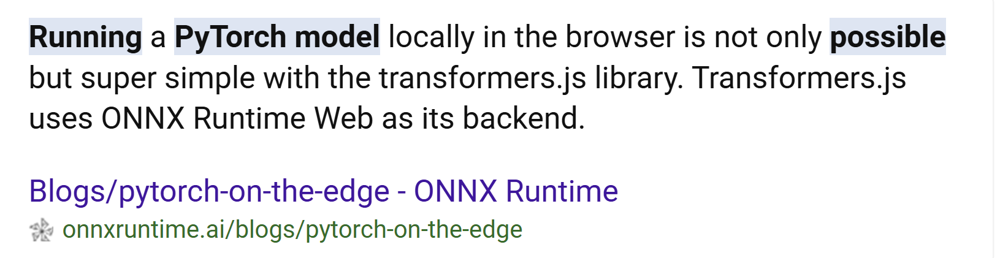

# Is it possible to run a neural network in the browser?

In short - yes, and it's supposed to be pretty simple. Especially using the ones generated by pytorch, which is what we are using.

https://onnxruntime.ai/blogs/pytorch-on-the-edge

I'm going to use this resource to run pytorch in thr browser, which will likely have me using the transformers.js library in conjunction with React.